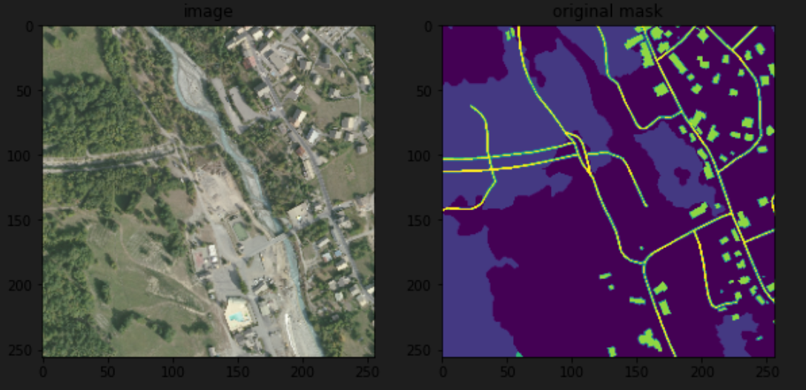

# Satellite segmentation project

The goal of this project is to create a neural network that performs the segmentation of satellite images.
The data used in this project is extracted from the [IGN](https://geoservices.ign.fr/telechargement) archives, and can be downloaded [here](https://drive.google.com/file/d/1y73mUPzS5Hhq1RjPXc9bxch-Nv6HlJem/view?usp=sharing).

Here is an example of the image/mask contained in the dataset:

